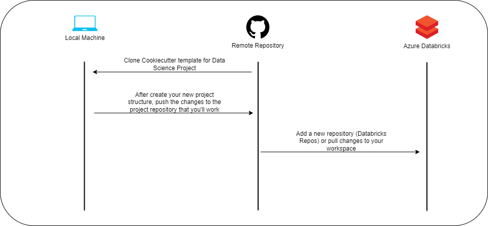

# Cookiecutter Data Science Project

_A flexible project structure for doing and sharing data science work._


#### [Project homepage](https://github.com/matgonz/cookiecutter-data-science-project/)


### How to use the template
1. Install the cookiecutter package
2. Run the command: "cookiecutter https://github.com/matgonz/cookiecutter-data-science-project"
3. Fill the params in your promp
4. After all, you will have a repository to start your data science project
<br/><br/>

<br/><br/>
### Requirements to use the cookiecutter template:
-----------
 - Python 2.7 or 3.5+
 - [Cookiecutter Python package](http://cookiecutter.readthedocs.org/en/latest/installation.html) >= 1.4.0: This can be installed with pip by or conda depending on how you manage your Python packages:

``` bash
$ pip install cookiecutter
```

or

``` bash
$ conda config --add channels conda-forge
$ conda install cookiecutter
```


### To start a new project, run:
------------

    cookiecutter https://github.com/matgonz/cookiecutter-data-science-project


[](https://asciinema.org/a/244658)


### The resulting directory structure
------------

The directory structure of your new project looks like this: 

```

├── README.md          <- The top-level README for developers using this project.
│
├── requirements.txt   <- The requirements file for reproducing the analysis environment, e.g.
│                         generated with `pip freeze > requirements.txt`
│
├── src                <- Source code for use in this project.
│   ├── __init__.py    <- Makes src a Python module
│   │
│   ├── features       <- Scripts to turn raw data into features for modeling
│   │   └── build_features.py
│   │
│   ├── models         <- Scripts to train models and then use trained models to make
│   │   │                 predictions
│   │   ├── predict_model.py
│   │   └── train_model.py
│   │
│   ├── monitoring  <- Scripts to monitoring models in production
│   │   └── visualize.py
│   │
│   └── utils  <- Scripts with utils functions to help about loading data, feature store, mlflow use
│       └── feature_store_utils.py
|
│
```


### Installing development requirements
------------

    pip install -r requirements.txt

### Running the tests
------------

    py.test tests


<p><small>Project based on the <a target="_blank" href="https://drivendata.github.io/cookiecutter-data-science/">cookiecutter data science project template</a>. #cookiecutterdatascience</small></p>
